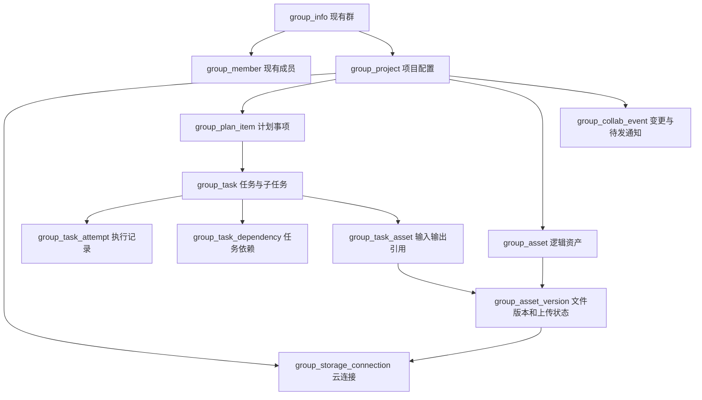

# 群协作整体开发计划附件：数据库结构

日期：2026-09-07。状态：原设计附件，未执行 DDL 或连接生产数据库。编码已开始，P1 已准备三张表的迁移文件；当前实际字段与剩余项见[实施记录](2026-09-07-group-collaboration-implementation.md)。[整体开发计划 v1.0](2026-09-07-group-collaboration-development-plan.md)保留完整设计基线；本附件补充关键字段、约束和事务细节，不构成另一套实施计划，也不表示下述全部表已实现。

## 1. 修改范围

建议在 Chatroom 现有 MySQL 中新增 **10 张协作表**，其中 7 张为业务记录、3 张为依赖/引用/事件记录；复用现有 `group_info` 与 `group_member`。旧表只建议为 `group_member` 增加一个授权版本字段。Lite 的 SQLite 另加 2 张本地执行恢复表。

现有群迁移脚本将数据库标为 `chat_biz`，实际连接由 `server/db.js` 的 `DB_NAME` 指定。本轮仅核对源码，未将该名字或迁移文件当作生产数据库实况。

| 所在位置 | 放什么 | 不放什么 |
| --- | --- | --- |
| Chatroom MySQL | 项目配置、计划、任务、执行状态、受限云凭证密文、资产索引、必要事件 | 资产文件正文、Base64、文件预览缓存、Provider 原生会话 |
| Lite SQLite | 本机执行与 Provider 会话的关联、已接收命令、待回传事件、临时工作文件定位 | 项目权威成员表、管理员云主密钥、全项目文件副本 |
| 客户云空间 | 项目资产文件及其不同版本对象 | 不由 VOKO 代建自有 OSS 存放 |

不新增项目成员、专家、技能、聊天记录或独立 Run 表。群与项目首版一对一，`group_id` 就是协作数据的项目归属键，沿用现有 `group_info.id`；Lite/Web 继续按接口约定使用 `channelId`，由服务端解析归属。

## 2. 原有表的处理

`group_info` 的群名、群主、频道、公告 `notice` 和解散状态继续使用，不复制到另一份项目资料。原公告直接复用为项目公告，内容保留，不删除字段、不建新公告表。是否启用协作由新增项目配置表表示；没有配置记录的旧群继续按普通群处理。

`notice` 表示重要通知/公开说明，`group_project.instructions` 是可选内部协作规则，分别维护，不复制或自动同步。当前 `searchGroups` 会向搜索者返回公开群的 `notice`，因此不能将内部规则自动迁入该字段。公告沿用管理员更新接口，规则通过项目成员鉴权接口读取；任务执行记录保留当次实际使用的规则快照。公告和规则都不作为云凭证或私密文件的存放位置。

`group_member` 继续是成员与角色的唯一事实来源，保留现有 `owner/admin/member`、`normal/quited/kicked` 语义。建议增加：

| 字段 | 建议类型 | 用途 |
| --- | --- | --- |
| `auth_version` | `BIGINT UNSIGNED NOT NULL DEFAULT 1` | 成员状态或权限角色真实变化时递增，区分不同授权期间 |

例如 Agent B 在授权版本 3 领取任务；退群及再次加入后已经是更高版本。B 重发版本 3 的完成消息，不因它“现在又是成员”就被接受。领取、资产登记、执行回执校验当前成员状态与授权版本；相关群成员变更必须与版本递增在同一事务完成。不能靠精度有限的 `updated_at` 替代该版本号。

授权版本只约束 VOKO 的新授权与回执处理，不能让已签发的云端下载链接立即失效，也不能收回已下载文件。群禁言与任务/文件权限如何对应需显式规则，不把原本的聊天禁言自动解释成全部协作权限撤销。

## 3. 七张业务记录表

### `group_project`：群的协作配置

主键直接使用 `group_id`，外键指向 `group_info.id`，每群最多一行。

关键字段：`status`（配置中/启用/停用/归档）、`instructions`、`default_leader_uid`、`max_concurrency`、`max_task_count`、`max_duration_seconds`、`row_version`、`event_seq`、`created_by_uid`、`created_at`、`updated_at`。

群名与成员仍查原表；`default_leader_uid` 是默认任务负责人，不是第二个群主。`event_seq` 仅用于项目内事件排序。运行额度使用独立列，少量不参与查询的可选设置可以使用有版本和大小限制的 JSON。

### `group_storage_connection`：项目云空间与凭证

关键字段：`id`、`group_id`、`provider`、`region`、`bucket`、`endpoint`、`status`、`credential_ciphertext`、`encryption_key_id`、`credential_version`、`capabilities_json`、`last_checked_at`、`last_error_code`、`row_version`、时间戳。

首版对 `group_id` 建唯一约束，每项目一条云连接。Endpoint 由已支持厂家/区域规则验证，不能把配置变成任意地址请求。项目受限 AK/SK 作为一个加密凭证包保存，解密主密钥在数据库外管理；接口只返回脱敏状态，密文列也不进入普通列表查询。

首次只有这一厂家连接需要验证，暂不新增通用连接器或独立凭证历史表。轮换时原子更新密文及 `credential_version`；资产引用连接 ID，不引用某个凭证版本。已有资产后不能直接把此连接改到另一 Bucket，防止旧索引被改写含义。

### `group_plan_item`：计划看板事项

关键字段：`id`、`group_id`、`title`、`description`、`assignee_uid`、`status`、`priority`、`due_at`、`sort_order`、`created_by_uid`、`row_version`、时间戳。

首版固定看板列，不单独建看板/列定义表。`status` 是计划的业务状态；`sort_order` 表示同列顺序，采用整数排序并对单列按需重排，不为此引入复杂排序机制。任务通过 `plan_item_id` 关联，一张事项可对应多个任务，一项任务首版只归属一张事项。

### `group_task`：协作任务和子任务

关键字段：`id`、`group_id`、`parent_task_id`、`plan_item_id`、`title`、`description`、`created_by_uid`、`leader_uid`、`assignee_uid`、`status`、`wait_reason`、`acceptance_json`、`current_attempt_id`、`spec_version`、`row_version`、`client_request_id`、时间戳。

根任务和子任务使用同一张表，根任务 `parent_task_id` 为空。`status` 表示执行事实，例如待执行、执行中、等待、待验收、完成、失败、取消；`wait_reason` 区分等待成员、资产、授权或结果未知。

`spec_version` 标识目标、分工和输入等执行规格，`row_version` 用于并发更新检查，两者不能混用。已开始执行后不直接覆盖其规格；调整后形成新规格及必要的新 attempt，原记录可追溯。描述、验收条件属于任务数据，必须限长，不用它们保存整份产物或完整模型轨迹。

### `group_task_attempt`：某项任务的一次执行

关键字段：`id`、`group_id`、`task_id`、`attempt_no`、`task_spec_version`、`executor_uid`、`executor_auth_version`、`device_id`、`status`、`spec_snapshot_json`、`input_manifest_hash`、`claim_token_hash`、`lease_expires_at`、`last_producer_sequence`、`cancel_requested_at`、`error_code`、开始/结束时间。

一次真正重试新增一行，而不是覆盖之前的错误；网络重送仍处理同一 attempt。规格快照只保留执行所需的有限任务参数与资产引用。设备必须通过已有身份关系验证，不能信任请求中的自报设备 ID；领取秘密不以明文入库。

`group_task.current_attempt_id` 指向当前认可的执行。回执必须匹配任务、当前 attempt、执行人、设备、成员授权版本及事件顺序。领取租约超时只表示需要核对，不等于 Provider 没执行；禁止据此直接启动第二次模型调用。Provider 原生 Session ID 只留在 Lite。

### `group_asset`：逻辑资产

关键字段：`id`、`group_id`、`display_name`、`created_by_uid`、`status`、`latest_version_no`、`row_version`、时间戳。

它表示“竞品分析报告”这份逻辑资产，负责列表展示和归档；不保存文件正文或下载 URL。尚在首次上传的记录可显示待交付，只有已就绪版本才能被任务使用。

### `group_asset_version`：具体文件版本，兼作上传记录

关键字段：`id`、`group_id`、`asset_id`、`version_no`、`storage_connection_id`、`upload_object_key`、`published_object_key`、`provider_version_id`（可空）、`status`、`size_bytes`、`media_type`、`declared_sha256`、`provider_checksum`、`producer_uid`、`producer_auth_version`、`producer_attempt_id`（可空）、`upload_request_id`、`upload_expires_at`、`uploaded_at`、`verified_at`、`ready_at`、`error_code`。

状态至少区分待上传、上传中、待确认、可用、失败/过期、云端缺失或已删除。失败上传保留这一行，重新完成请求不会多出版本；重新开始一次上传可生成新版本，允许版本号存在空缺。

`upload_object_key` 与 `published_object_key` 的含义取决于 P0 通过的防覆盖方案，可能相同，也可能由云内复制形成不同对象；`provider_version_id` 只在云厂商实测支持时填写。它们不是本机路径。对象键由 VOKO 生成且限制字符和长度，显示文件名独立保存。

`declared_sha256` 是上传者声明值；`provider_checksum` 记录云实际返回的算法和值，不把 ETag 自动当 SHA-256。`verified_at` 指云元信息核对时间，不表示服务端下载并校验过文件正文；下载端实际校验结果另记执行事件。最新版本指针只在版本确认可用的事务中更新，不能被较早上传的迟到回执倒退。

## 4. 三张关联和事件表

| 表 | 关键字段与约束 | 必要性 |
| --- | --- | --- |
| `group_task_dependency` | `group_id, task_id, task_spec_version, depends_on_task_id`；组合唯一，禁止自依赖，修改时校验同群、同次协作及无环 | 一个任务可等待多个任务，不将依赖 ID 塞进不受约束的 JSON |
| `group_task_asset` | `group_id, task_id, task_spec_version, asset_version_id, usage(input/output), slot_name`；对应关系唯一 | 一个任务可用多个文件，同一版本可供多个任务使用；始终引用具体版本 |
| `group_collab_event` | `id, group_id, event_seq, entity_type, entity_id, event_type, actor_uid, source_event_id, payload_json, notification_state, next_retry_at, published_at, created_at` | 保存必要动态与幂等事件，并兼作首版通知待发表 |

输入引用按执行规格固定，attempt 保留输入清单及摘要。输出资产必须能追溯到实际的 `producer_attempt_id`，旧 attempt 的产物不得冒充新执行的结果。不同执行规格的旧引用保留，不原地替换成新版本。

事件与业务状态在同一 MySQL 事务写入，后台再通知 UI/IM；首版无需额外建设一套 Outbox 表或消息总线。事件的业务部分不改写，通知发送状态可以更新。通知只用于唤醒/刷新，任务领取仍查询权威任务表，`published_at` 不代表 Agent 收到或执行成功。

事件负载仅包含必要变更摘要与引用，不保存文件正文、云签名链接、密钥或完整模型输出。项目内 `event_seq` 在锁定项目配置行后分配，与状态事务一起提交，客户端可按项目顺序恢复；不能简单假定全库自增 ID 的大小就是事务提交顺序。重复源事件受唯一约束，通知允许重送但消费方去重。

## 5. 关联、约束与索引

统一约定：

- `group_id` 沿用现有有符号 `BIGINT`，新表外键类型必须与原表一致；新实体主键可用同类型自增 ID。API 中以字符串传输数据库 BIGINT，避免 JavaScript 数字精度问题。
- 业务关联携带 `group_id`；给被关联表建立 `(group_id, id)` 唯一键，通过组合外键约束任务、父任务、计划、attempt、资产及云连接属于同一群。外键只保证归属完整性，接口仍须验证当前主体权限。
- 父任务/依赖的无环、同一次协作，以及负责人必须是有效成员等条件在事务中校验；执行规格被冻结后不允许并发原地改图。
- `current_attempt_id`、逻辑资产最新版本等循环关联按分步建表/加约束处理；当前 attempt 还须约束到同一 task。字段不能只因 ID 存在就被认为合法。
- 不对项目资产/执行历史做群删除级联。项目和资产归档、群软解散；新增引用采用限制硬删除的外键策略，避免删除群记录时连带丢失索引和历史。原有表的既有行为不在本次顺手重构。
- 时间建议统一 UTC 的 `DATETIME(3)`；状态采用受应用约束的短字符串，数据库可用的 CHECK 等约束须核对版本后决定。业务上要筛选、关联或排序的字段单独建列。
- 云对象键、幂等键和 SHA 等采用大小写敏感、长度受限的存储；云对象键索引不能受默认不区分大小写的排序规则影响。密文、JSON、完整错误文本不建立宽泛索引。

关键唯一约束：项目配置 `group_id`；云连接 `group_id`；任务创建 `(group_id, created_by_uid, client_request_id)`；执行 `(task_id, attempt_no)`；版本 `(asset_id, version_no)`；上传 `(group_id, producer_uid, upload_request_id)`；云对象 `(storage_connection_id, published_object_key)`；事件 `(group_id, event_seq)` 和 `(group_id, actor_uid, source_event_id)`。完成回执还要校验事件归属和当前授权，不能仅靠去重键放行。

关键查询索引：计划 `(group_id, status, sort_order, id)`；项目任务 `(group_id, status, updated_at, id)`；成员待执行任务 `(assignee_uid, status, id)`；子任务 `(group_id, parent_task_id, id)`；反向依赖 `(group_id, depends_on_task_id, task_id)`；资产列表 `(group_id, status, updated_at, id)`；待通知事件 `(notification_state, next_retry_at, id)`。只为实际页面与调度查询建索引，上线前用代表性数据检查查询计划。

## 6. 必须原子完成的四组写入

1. **领取任务**：校验群/成员/授权版本 → 锁定任务 → 创建或复用 attempt → 绑定当前 attempt → 写入事件 → 提交。不能先通知执行、后保存领取事实。
2. **确认资产**：云元信息及版本保护确认完成 → 在数据库事务内重新检查成员/attempt → 更新版本为可用 → 条件更新最新版本 → 绑定任务产物 → 写事件。外部云 API 在数据库事务外调用，失败或超时保留待确认状态并可核对重试，不在持有数据库锁时等待上传或云调用。
3. **完成任务**：验证当前执行与必需资产 → 更新任务及必要的计划进度 → 写事件。依赖推进程序以事务后的权威状态判断，重复事件不能重复派发。
4. **撤销成员权限**：成员状态/角色与 `auth_version` 一并更新；项目相关的待派发状态/事件一起处理。已在执行的任务另按终止回执更新，不能数据库改为取消就视为设备已停。

各路径需要统一锁顺序；成员变更、任务领取、资产确认的并发交错要做专门测试。不能用一串独立 `pool.execute` 代替同连接事务。跨云存储与 MySQL 不具有共同事务，用明确的上传/确认/发布状态及幂等恢复处理，不承诺不存在中间态。

## 7. Lite 只增加两类恢复记录

建议放入 Lite 现有 SQLite，以协作前缀隔离；不复用独立 A2A 数据表的授权命名空间：

| 表 | 主要字段 |
| --- | --- |
| `collab_local_attempt` | 服务端作用域、attempt/task/group 标识、本地 Agent、执行状态、成员授权版本、Provider 类型/实例、原生 session 关联、本地工作目录、开始/结束时间 |
| `collab_local_event` | 服务端作用域、event/attempt 标识、方向（收到的命令/发出的回执）、顺序号、有限 JSON 负载、处理/确认状态、重试时间 |

主键/唯一键包含服务端作用域，避免测试环境与正式环境 ID 碰撞。本地先持久化再执行或确认，Provider 执行结果未知时保留记录，不自动重复执行。文件留在临时工作目录而不是 SQLite；项目云凭证不下发至这些表。

## 8. 分阶段迁移与核验

| 对应开发阶段 | 数据库变化 |
| --- | --- |
| P1：项目与计划 | 新增 `group_project`、`group_plan_item`、`group_collab_event`；为 `group_member` 增加 `auth_version` 并接入真实权限变更路径 |
| P2：资产 | 新增 `group_storage_connection`、`group_asset`、`group_asset_version` |
| P3：执行 | 新增 `group_task`、`group_task_attempt`、`group_task_asset` 及 Lite 两张本地恢复表；此时补充 P1/P2 表中指向 task/attempt 的约束 |
| P4：多 Agent 依赖 | 新增 `group_task_dependency`，完成无环检查和依赖调度 |

不预先为所有旧群插入项目配置，不搬迁聊天记录，也不把原有 OSS 附件批量复制到客户云空间。旧群启用项目时才创建对应配置；旧附件继续属于原功能路径。

现有源码存在增量迁移与初始化 SQL 重叠的情况，例如 `001_group.sql` 已含 `mute_until`，而 `003_group_member_mute.sql` 仍执行加列。此次必须先核对实际列、索引、外键和迁移执行方式，再编排新增迁移，不能盲目重放整个目录。迁移编号实施时按目标仓库当前序列确定。

上线前验证：旧库升级及空库初始化、重复执行/中断后的迁移恢复、外键与索引、跨群 ID 拒绝、并发领取、迟到回执、成员退群重入、同名版本并发确认、事件重送、数据量与查询计划。MySQL 版本、在线 DDL 行为和生产锁表影响目前未核实，不能承诺无锁升级。

回退优先关闭协作入口和新任务领取，保留数据库数据、待核对执行及客户云文件，不直接 DROP 新表。旧版本不能理解的新本地数据库版本需显式拒绝或按兼容策略处理；回退步骤必须在发布前演练。

源码依据：[群表初始化](</Users/laoyu/Documents/ChatGPT/voko-chatroom/server/migrations/001_group.sql>)、[群软解散迁移](</Users/laoyu/Documents/ChatGPT/voko-chatroom/server/migrations/005_group_dissolve.sql>)、[群服务](</Users/laoyu/Documents/ChatGPT/voko-chatroom/server/services/group.js>)、[数据库连接](</Users/laoyu/Documents/ChatGPT/voko-chatroom/server/db.js>)、[Lite 主库](../../src/core/database.ts)、[独立 A2A 执行恢复](../../src/a2a/task-store.ts)。
