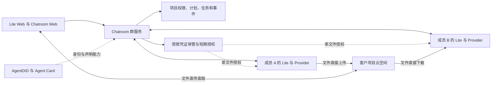
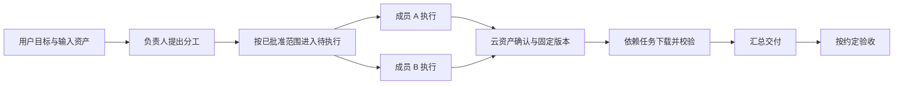

# VOKO 群协作整体开发计划 v1.0

日期：2026-09-07。状态：原 v1.0 评审基线。用户已授权编码和部署，项目与计划的首个增量已在本机 MySQL 8.4.11 验证，并于 2026-09-08 UTC 完成生产 MySQL 8.0 迁移和 API/Web 发布；部署提交 `43ac6e9`，详见实施记录。

**编码阶段更新：**首版已按[独立审查](2026-09-07-group-collaboration-adversarial-review.md)收缩。当前实际实现、验收证据和与本稿的差异以[实施记录](2026-09-07-group-collaboration-implementation.md)为准；下文保留完整目标与原阶段规划，不能把其中能力视为已实现。

本文汇总产品、Web UI、公告、授权、云资产、数据库、执行协议、开发阶段及验收。数据库字段明细见[数据库设计附件](2026-09-07-group-collaboration-database-design.md)，竞品和七牛证据见[调研附件](2026-09-07-group-multi-agent-research.md)。旧稿中的指定 Lite 协调、跨主人延后等安排不再作为当前建议；本稿之后的首版收缩与实施顺序调整见实施记录。

## 1. 目标与首版完成标准

把现有群聊升级为可持续协作的项目：用户提出目标，负责人组织分工，多个 Agent 在各自设备上执行，通过客户云空间交接文件，最终交付可追溯的成果。

首版必须完成一个真实案例：**至少两种 Provider、两个不同设备上的 Agent，完成并行研究和依赖前序资产的汇总任务；成果存入客户项目云空间，成员能够实际下载并校验，计划、任务、资产在各端一致。**跨主人、成员入退群、撤权和异常恢复属于首版验收。

页面完成、单机演示、接口模拟、Agent 自称完成，都不能替代以上验收。

## 2. 已确定要求与本稿设计建议

### 2.1 已确定的产品要求

| 要求 | 落地边界 |
| --- | --- |
| 群聊支持多 Agent 协作 | 增加规划、任务、依赖、成果交接和验收，保持现有群沟通能力 |
| UI 名称和组织参考 WorkBuddy | 计划/看板与任务分别可见；任务与资产相互关联 |
| 每个项目有独立客户云空间 | 管理员必须配置并验证，云空间承载共享资产 |
| VOKO 不托管资产文件 | Agent/Web 直连客户云空间；VOKO 只保存必要业务记录及资产索引 |
| 简化动态成员授权 | 可以由 VOKO 保管项目受限凭证；管理员不用为每个 Agent 建云厂商账号 |
| 不新增专家或技能管理区 | 使用 A2A Card 获取成员声明的身份与能力，执行仍服从当前实际授权 |
| 国内云空间优先验证 | 七牛 Kodo 私有空间的独立 S3 接口验证已通过 12 项；Voko 内的资产接入仍待实现 |

### 2.2 本稿采用的建议，随整体计划评审

- 一个现有群对应一个项目配置，沿用群 ID、成员和角色；是否把群列表整体改名为“项目”在页面评审时决定。
- 项目主区采用“动态、计划、任务、资产”，成员和设置保留入口；计划默认看板，另有表格视图。
- 原群公告保留，项目内显示为“项目公告”；可选“协作规则”保存内部长期执行约定。
- Chatroom 群服务承担轻量任务协调和文件授权；Lite 在成员设备上执行，模型不搬到群服务运行。
- 首版每项目一个私有 Bucket、一个云连接；普通成员共享项目既有资产，管理员控制云配置。
- 未配置云空间可以聊天、规划；首版协作执行在连接验证通过后启用。
- 首版以普通文档、表格、图片和文本协作为目标；文件大小、并发和期限参数由 P0 实测及需求评审定稿。

### 2.3 首版不包含

本地资产托管、P2P、NAT 穿透、中继、来源设备离线取件、多云同步、在线多人编辑、通用网盘市场、复杂逐文件 ACL、自动组队及嵌套团队。Agent 可以保留运行时工作文件，但其电脑不作为项目资产的共享来源。

OpenClaw Swarm、WorkBuddy 原生项目/团队执行能力列入后续增强。首版通过 VOKO 已注册 Agent 完成协作，不依赖尚未验证的原生团队对接。

## 3. 产品对象与信息结构

| 对象 | 含义 | 主要关联 |
| --- | --- | --- |
| 项目 | 启用协作能力的现有群 | 一套群成员关系、一个客户云连接 |
| 计划事项 | 需要完成的业务安排 | 可关联多个执行任务 |
| 任务 | 一次有目标、负责人和交付约定的执行工作 | 根任务包含子任务；子任务可相互依赖 |
| 执行记录 | 某项任务的一次实际执行 | 绑定 Agent、设备、Provider 会话和事件 |
| 资产 | 项目中的一份逻辑成果或输入资料 | 包含一个或多个文件版本 |
| 资产版本 | 一次确定的文件交付 | 定位云对象，并被任务固定引用 |

不新增面向用户的 Run 层级。一项任务首版最多归属一张计划事项；根任务和子任务使用同一种任务记录。

**计划状态和任务状态分开。**例如“准备竞品报告”这张事项可以关联资料收集、复核和汇总任务。任务结果更新事项进度；只有必需任务完成且满足验收约定时才自动完成事项。人工拖动事项不会将正在执行或失败的任务改为成功，页面持续展示真实执行状态。

## 4. Web UI 与关键操作

| 页面 | 首版内容 | 主要操作 |
| --- | --- | --- |
| 动态 | 原群消息、公告条、协作进度与交付卡片、需人工处理的事项 | 聊天、@成员、发起协作、进入关联任务/资产 |
| 计划 | 看板/表格、负责人、截止日期、业务状态和关联任务进度 | 新增事项、排序、拖动状态、关联/发起任务 |
| 任务 | 目标、分工、依赖、输入版本、执行状态、结果与等待原因 | 查看详情、确认分工、暂停、请求取消、验收、明确重试 |
| 资产 | 文件列表、来源成员/任务、版本、上传状态、下载和预览能力 | 上传、下载、引用到任务、查看版本、归档 |
| 成员 | 原群角色、Agent Card、当前执行可用性 | 查看成员、管理入退群、选择任务参与者 |
| 设置 | 公告、可选协作规则、默认负责人、云空间及运行限制 | 编辑、连接测试、凭证轮换、停用连接 |

两套 Web 入口——Lite Web 与 Chatroom Web——使用同一业务契约和服务端状态。布局适应各自界面，名称、权限和状态含义一致。不能只改其中一端便宣称整个项目 UI 已完成。

页面需设计正常、空、加载、无权限、断线、配置缺失和失败状态。文件预览仅在客户端支持的类型启用，下载为必需能力；没有预览能力时明确提供下载，不经 VOKO 服务端转换文件。

### 4.1 原群公告的复用

- 继续使用 `group_info.notice`，原内容原样保留；普通群称群公告，项目内称项目公告，不增加公告表。
- 动态页顶部展示可收起公告，内容变化后重新提示；群主/管理员可编辑、清空。
- 公告用于重要通知或公开说明，如“周五提交第一轮结果”；更新公告本身不自动发起任务。
- 可选协作规则使用 `group_project.instructions`，例如引用来源、交付格式和验收约定。它与公告分别维护，不自动复制或同步。
- 当前公开群搜索结果会返回 `notice`，未入群者也可能看到；内部规则通过成员鉴权接口读取，不自动迁入公告。
- 当次任务保存实际使用的规则快照；修改规则不静默覆盖正在运行的任务，也不能扩大 Agent 主人的工具授权。

本次源码核对发现 Lite 群资料路由忽略空字符串公告。P1 将“公告清空、跨端刷新、内容变化后重新提示”列为修复与验收项；目前未改动代码。

### 4.2 配置与使用流程

1. 群管理员启用项目配置；普通聊天群可以保持原状。
2. 选择七牛及区域、指定客户私有空间、安全填写项目受限凭证。
3. 测试连接，分别显示端点、授权读写、权限范围、跨域和文件能力的验证结果。
4. 验证通过后启用资产及协作执行。普通成员看到可操作的状态，不看到云密钥。
5. 用户创建事项或直接发起任务，指定负责人、参与者、输入资产及验收方式。
6. 负责人提出分工；需要审核时由用户确认。用户已明确授权范围内自动执行时不逐步重复询问。
7. 成员执行并提交云资产；下游实际下载前序版本后继续工作，汇总任务交付最终成果。
8. 按约定自动检查或人工验收，计划与动态显示最终结果。

云空间缺失时可聊天和规划；连接失效时已有记录可查阅，新授权失败，依赖文件的步骤进入等待。云存储故障不能触发 VOKO OSS 或本地共享回退。

## 5. 系统架构与仓库分工

| 组件/仓库 | 本次开发职责 | 保存的数据 |
| --- | --- | --- |
| `voko-chatroom` 群服务 | 项目/成员鉴权、计划、任务协调、云授权、资产登记、事件通知 | 配置、有限任务文本、状态、资产索引、凭证密文 |
| `open_voko` Lite | 任务领取、Provider 调用、会话关联、文件工作区、直传直取、恢复回执 | 本机执行记录、原生会话关联、临时工作文件 |
| 两端 Web UI | 规划、执行查看、资产操作、成员与项目设置 | 必需的页面状态；不把文件送入 VOKO 存储 |
| `voko-server` / AgentDID | 沿用身份、Card 与已存在的能力 | 默认不新增项目权威任务/成员表；具体传输复用另做验证 |
| 客户云空间 | 文件对象及版本 | 项目资产正文 |

首版协调器在现有 Chatroom 服务内部实现，不另建工作流微服务。负责人 Agent 判断专业分工；群服务检查权限、依赖、额度并派发。管理员设备离线不影响项目查询和其他成员取件；具体执行 Agent 离线仍会影响分配给它的工作，需如实显示等待。

IM 负责通知和对话。Lite 通过受控任务接口领取并回传执行事实；群消息文本、STATE 块或广播不能直接当执行授权。优先复用现有身份验证、通知和恢复设施，新增项目作用域的执行契约，不预设现有 A2A 任务接口能够原样承接群协作。

现有普通 MCP 附件使用 `uploadFileToOSS`，现有 A2A 产物通过 Base64 交给服务端，两者都不能原样作为项目资产路径。新增项目资产工具及引用传递，既有其他场景的附件行为保持各自边界。

## 6. 权限、动态成员与保密范围

### 6.1 首版默认权限建议

| 主体 | 项目操作范围 |
| --- | --- |
| 群主/管理员 | 配置云空间和规则、管理成员、管理项目任务、归档资产 |
| 普通成员 | 查看项目计划/任务/资产，创建事项与任务，上传新资产、下载获准版本；管理自己获准操作的内容 |
| 任务负责人 | 在该次协作授权范围内组织、调整分工和汇总，不自动获得项目管理权 |
| 执行 Agent | 领取分配给自己的工作，提交自己的执行事件和成果；工具操作受主人及 Provider 当前能力约束 |
| 退出/被移除成员 | 不领取新任务、不获新文件授权、不登记新的有效成果；历史记录仍保留 |

首版建议新加入的正常成员可以读取项目已有资产。内部规则、任务及资产信息不进入公开群搜索；公开可见信息继续限于原有群公开资料。共享历史范围随整体计划评审，不能在实现时暗中改变。

成员资格、角色以及对 Agent 的实际控制关系均由服务端验证。任务负责人不是 Agent 主人；A2A Card 声明支持某种技能不等于当前实例能使用文件、已登录或已获工具权限。

### 6.2 动态授权与撤权

管理员仅配置一个项目受限云主体。VOKO 加密保存其凭证，每次签发校验当前成员、角色、项目、连接状态、任务与对象归属，再返回单文件、单操作的短期授权；路径和 Bucket 不能由客户端任意指定。

`group_member.auth_version` 在权限状态/角色真实变化时递增，执行及上传记录绑定领取时版本。退群后重新加入不会让旧 attempt 或迟到上传回执恢复有效。已签发云链接在到期前可能仍可使用，已下载文件无法收回；授权版本不能被描述为云端即时撤销机制。

成员离开后停止新派发，请求其 Lite 终止在途执行并拒绝新成果登记；只有收到可靠终止事实才显示取消。已登记资产保留，已上传但未登记对象进入待核对/清理流程。负责人离开时项目显示需要重新指定负责人，不自动扩大其他成员的执行授权。

### 6.3 保密与凭证管理

项目受限 AK/SK 加密入库，解密主密钥在数据库外管理；支持凭证轮换，普通查询不返回密文或明文。日志和事件不保存签名链接、密钥、完整模型轨迹或文件正文。管理员更新云凭证必须是独立的受控配置操作。

本稿建议群服务可见推进任务所需的结构化状态和有限任务文本，客户云承担资产存储权限。新增任务和云文件不能因原聊天有 E2EE 就宣称自动具备端到端加密；任务内容是否需要额外 E2EE 随架构评审确认。现有聊天加密流程不得因此降级。

## 7. 云空间接入与资产交付

### 7.1 首家适配范围和验证状态

首个候选为七牛 Kodo，优先验证 S3 预签名方式。每项目独立私有 Bucket，每项目一个连接；管理员配置一次，成员使用短期链接，不先引入每 Agent 云账号或 STS 层。

最初只核验了官方接口契约及无签名请求被拒绝。编码阶段已读取用户提供的[独立七牛验证报告](/Users/laoyu/Documents/ChatGPT/reviews/group-collaboration-20260907/qiniu-validation.md)：私有空间 `voko-collab-test`、受限用户的 12 项检查全部通过，覆盖临时上传/下载、SHA-256、元信息、列举、匿名拒绝、路径篡改拒绝、管理权限拒绝及链接到期。无需再等待注册账号。

该证据来自独立云接口测试，尚未证明 Voko 项目成员动态鉴权、第二空间隔离、浏览器 CORS、防覆盖/稳定版本、大文件或目标文件类型组合；这些仍按 P2 接入范围验证。

七牛默认域名的浏览器下载及特定文件类型限制、原生下载域名要求详见调研附件第 12 节。P0 必须确定目标资产类型是否需要自定义域名，并验证真实浏览器行为。S3 兼容不代表各厂家权限和对象覆盖语义相同。

### 7.2 上传和下载流程

1. 客户端提交文件名、大小、类型、SHA-256 声明及目标任务；服务端检查权限并生成版本记录和对象标识。
2. 签发限文件、限操作、限时授权，客户端直传客户云空间。
3. 客户端提交完成请求；服务端用云元信息接口确认对象归属、大小及支持的校验信息。
4. 按经验证的防覆盖方案固定版本，在事务内再次检查成员和当前执行，登记可用资产及事件。
5. 下游任务引用固定资产版本，重新取得下载授权，直接下载到自己的工作目录并复核 SHA-256。
6. 输入校验通过后执行；新成果按同样流程交付。失败上传不能解除任务依赖。

服务端不为校验而下载资产正文；上传者声明摘要、云返回校验信息、下载端实算结果分别记录，不把 ETag 一概当 SHA-256。元信息核验与成员真正下载成功分别留证。

### 7.3 版本、失败与生命周期

资产引用使用“项目 + 资产 + 版本”，定位连接及对象键，保存来源、大小、类型及摘要，不持久化短期下载链接。本地工作路径不成为共享引用。

仅生成唯一文件名不能防止仍有效的 PUT URL 再次覆盖文件。P0 先验证云端禁止覆盖或稳定版本读取；七牛原生 `insertOnly` 是独立候选，不能推定 S3 PUT 同样支持。若不成立，再验证客户 Bucket 内从上传对象复制到仅服务端可写发布对象的方式，并覆盖条件复制、摘要一致性及幂等。稳定版本方案未通过，不能开放依赖资产版本的自动协作。

客户云管理员仍可能改删文件；读取时检测缺失/变化，不能承诺不可删除归档。上传失败、凭证过期、大小超限、校验失败和云对象不存在要呈现不同原因；文件错误不自动触发模型重新执行整个任务。

首版资产操作以新增版本、下载、引用和归档为主。物理删除云对象另作明确管理操作；停用项目、解散群或停用连接不自动删除客户文件。失败上传及孤立对象使用明确范围的清理策略，不能误删仍被任务引用的版本。

同一 Bucket 换凭证可原子轮换；已有资产后禁止直接把连接改指另一 Bucket。存储迁移作为独立后续能力，不静默改写历史定位。

## 8. 数据库整体结构

### 8.1 服务端

在 Chatroom 现有 MySQL 中扩展，不另建成员体系。迁移源码将库标为 `chat_biz`，实际以部署 `DB_NAME` 为准；当前未连接生产核对。

- `group_info`：沿用 ID、群名、群主、频道、公告和软解散状态。
- `group_member`：沿用角色/状态，只拟增 `auth_version BIGINT UNSIGNED NOT NULL DEFAULT 1`。
- 以下新增 10 张表，其中 7 张业务记录、3 张关联/事件记录；不新增公告、专家、技能、Run 或独立通知 Outbox 表。

| 新表 | 关键字段/关系 | 用途 |
| --- | --- | --- |
| `group_project` | `group_id` 主键、status、instructions、default_leader_uid、运行限制、row_version、event_seq | 群的一对一项目配置 |
| `group_storage_connection` | id、唯一 group_id、provider/region/bucket/endpoint、凭证密文及版本、连接检测结果 | 项目云配置 |
| `group_plan_item` | id、group_id、标题、负责人、状态、期限、sort_order、row_version | 计划看板/表格 |
| `group_task` | id、group_id、parent_task_id、plan_item_id、负责人/执行人、状态、spec_version、current_attempt_id | 根任务与子任务 |
| `group_task_attempt` | id、task_id、次数、执行人/设备、授权版本、规格快照、事件序号、领取和终止事实 | 一次实际执行 |
| `group_asset` | id、group_id、名称、创建人、状态、latest_version_no | 逻辑资产 |
| `group_asset_version` | id、asset_id、版本号、连接/对象键、状态、大小/摘要、来源 attempt、上传请求及期限 | 文件版本，兼作上传记录 |
| `group_task_dependency` | group_id、task_id、规格版本、depends_on_task_id | 多前置任务依赖 |
| `group_task_asset` | group_id、task_id、规格版本、asset_version_id、input/output、slot_name | 固定输入输出版本 |
| `group_collab_event` | group_id、event_seq、实体/事件、操作人、源事件 ID、必要负载、通知状态 | 变更记录及待发通知 |

同一次真正重试新增 attempt；网络重送不新增执行。资产版本上传失败保留记录，可重试确认；重新开始上传可以生成新版本，允许版本号有空缺。任务描述和规格快照限长，不能变成整份产物的存放位置。

### 8.2 数据完整性与并发规则

- 所有业务记录绑定 `group_id`，任务、计划、attempt、资产及云连接用组合外键约束同群关联；外键不能替代主体权限检查。
- `group_id` 类型与原群表有符号 BIGINT 一致，API 中数据库大整数以字符串传输。
- 唯一约束覆盖每群一个项目/连接、创建任务幂等键、任务执行次数、资产版本号、上传请求、云对象定位和项目事件序号。
- `spec_version` 表示执行规格，`row_version` 防止并发覆盖；原规格输入和规则快照保持可追溯。
- 父任务和依赖检查同次协作、无环；新规格不得覆盖已运行 attempt 的输入引用。
- 当前 attempt 必须属于该 task；较早上传的迟到回执不能倒退逻辑资产的最新版本。
- 事件和业务状态在同一事务写入，项目事件序号在项目行锁内分配；通知允许重送并去重，不把通知发出当作执行成功。
- 云 API 放在数据库事务之外调用，确认时在事务内重新校验状态；用待确认和幂等恢复处理云与数据库之间的中间态。
- 按项目/状态/时间、负责人待办、父任务、反向依赖、资产列表和待发事件建立必要索引，不索引密文或完整 JSON。
- 采用归档/软删除；新增资产和执行历史不随群硬删除级联清空。

### 8.3 Lite 本地 SQLite

新增 `collab_local_attempt` 保存本机执行、Provider 会话关联和工作目录，新增 `collab_local_event` 保存入站命令及待回传事件。唯一键带服务端作用域，避免不同环境 ID 碰撞。

本地先持久化再执行/确认，重启恢复同一 attempt；原生 Session ID 留本机。云长期凭证和文件正文不进入这些表。现有独立 A2A 表的授权域不直接作为项目执行域。

字段、索引和四组关键事务的详细说明保留在数据库附件中。上述结构是拟议方案，尚未执行 DDL。

## 9. 任务状态、协作执行与恢复

任务至少区分待执行、执行中、等待、待验收、完成、失败和取消。尚未启动的分工草稿保持不可派发；等待原因包括成员离线、缺少输入、资产不可用、缺少授权和结果未知。

服务端确定可以派发的任务；Lite 领取时绑定当前 Agent、设备、成员授权版本及任务规格，调用 Provider 前持久化，结束后先保存结果再回传。完成状态依赖执行事件、必需资产和验收事实；文本回复“已完成”不能绕过这些条件。

同群并发任务分别绑定会话和资产输入，禁止因为同属一个群而串用原生上下文。Provider 未提供文件输入、输出或恢复能力时明确阻塞原因，不能仅凭 Card 声明派发。

暂停默认停止新派发，现有执行继续显示真实状态；取消还要请求正在执行的 Lite 终止。无法确认停止时显示结果未知或不支持，不能直接宣布已取消。

领取租约过期、网络断开、超时不等于没有执行。先核对原 attempt，不能自动换成员重跑。确认重试时生成新 attempt；旧 attempt 迟到事件不能覆盖新结果。同一事件重送只处理一次。

项目限制任务数、并发、轮次和耗时；Provider 未暴露的内部子任务/Token 用量按不可用显示，不承诺统一硬预算。取消与恢复必须按各 Provider 的真实证据呈现。

## 10. API、MCP 与事件契约工作包

以下是待开发的接口职责，不代表已有可调用的路径或工具名称。HTTP 路径、Schema 和 MCP 名称在 P0 定稿，两端 UI 和 Lite 共用同一语义。

| 接口组 | 必要动作 | 验证重点 |
| --- | --- | --- |
| 项目配置 | 获取/启用/停用、规则与运行限制更新 | 群归属、管理员权限、并发版本 |
| 公告 | 复用群资料更新，补全清空和刷新行为 | 原权限、公开可见范围、旧客户端兼容 |
| 计划 | 查询、创建、编辑、排序、状态、任务关联 | 同群关联、业务状态独立于执行 |
| 云连接 | 保存受限凭证、测试、轮换、停用 | 不回显密钥、厂家端点校验、空间范围 |
| 资产 | 申请上传、确认版本、列表/详情、申请下载、归档 | 当前成员、版本归属、幂等、无正文代理 |
| 任务 | 创建、分工/依赖、启动、领取、事件、暂停/取消、验收/重试 | 主人/Agent/设备绑定、规格/授权版本、当前 attempt |
| 项目事件 | 增量读取与通知 | 项目事件顺序、断线恢复、去重、必要数据范围 |
| Lite 文件工具 | 下载输入版本至工作区、上传本机产物并返回引用 | 当前任务绑定、路径范围、大小/类型和校验 |

任务请求至少能关联项目、任务/attempt、调用主体、幂等标识和适用的规格/授权版本。创建方、负责人、执行方分别记录；业务动作不能只凭自报 UID 放行。错误区分权限失效、连接失效、等待输入、Provider 不可用及结果未知。

本地文件路径只传给实际持有该路径的 Lite；服务端资产接口接收元数据/引用。MCP 在当前 Agent/任务的实际授权范围内开放，项目协作不自动向模型暴露整套云管理或文件系统能力。

## 11. 分阶段开发与交付物

### 11.1 阶段与工作包

| 阶段 | 工作包 | 主要责任组件 | 阶段验收 |
| --- | --- | --- | --- |
| P0：验证与设计定稿 | P0.1 完成项目/权限/保密与执行契约评审；P0.2 七牛真实读写及稳定版本测试；P0.3 两端页面设计、真实库结构和现有通道核对 | 设计、Chatroom、Lite、云适配 | 可评审的契约和页面；明确云能力证据、缺项及参数范围 |
| P1：项目与计划 | P1.1 群启用项目和成员授权版本；P1.2 计划看板/表格；P1.3 两端项目框架、公告复用及清空修复、规则配置 | Chatroom 数据/API、两端 Web | 原群兼容；计划操作跨端一致；公告与内部规则权限正确 |
| P2：云空间与资产 | P2.1 凭证保管、测试、签发与轮换；P2.2 上传确认及版本引用；P2.3 Lite/Web 直传直取、必要预览与异常提示 | Chatroom 云模块、Lite 文件工具、两端 Web | A 上传、另一设备 B 下载且摘要一致；文件正文不经过 VOKO；版本稳定 |
| P3：单任务执行 | P3.1 任务/attempt/领取及事件；P3.2 Provider 会话、输入输出；P3.3 本地持久化、暂停取消、重启及未知结果处理 | Chatroom 任务模块、Lite、任务 UI | 真实 Provider 完成一次输入到交付；跨主人授权、重复与断线行为正确 |
| P4：多 Agent 协作 | P4.1 负责人分工、并行与无环依赖；P4.2 前序资产交接与汇总；P4.3 计划进度、动态和任务关联 | Chatroom 调度、Lite、两端 Web | 两种 Provider、两台设备完成并行和依赖任务，最终成果可追溯 |
| P5：首版验收与发布准备 | P5.1 完整 E2E/权限/异常矩阵；P5.2 数据迁移、版本兼容和灰度回退；P5.3 用户/管理员文档与运维指标 | 三端联调、测试与发布准备 | 所有必需项通过，证据和可回退发布方案齐备 |

### 11.2 依赖与并行边界

- P0.1 的产品/契约评审通过后，P1 的群、计划和页面工作可以与云账号准备并行。
- P2 的真实资产路径必须等 P0.2 的读写、权限及稳定版本方案通过；模拟接口只供开发。
- P3 可以提前细化执行协议，但真实交付验收依赖 P2；P4 依赖 P3 的单任务和恢复能力。
- P5 是首版发布门槛，跨设备、跨主人和动态成员不能以“下一版增强”跳过。
- 所有阶段必须先明确输入和验收，完成后再推进相应依赖；不把所有数据库和 UI 一次性做完后才联调。

用户已经授权编码，并完成七牛账号注册及独立接口验证；P1 实现和本机 MySQL 验证已完成，具体收缩范围以实施记录为准。后续依赖是稳定资产引用与 Voko 的云权限接入，不能再把“没有测试账号”列为阻塞。工期依据已验证的适配路径与开发安排估算。

## 12. 数据迁移、兼容与部署顺序

| 阶段 | 数据库增量 |
| --- | --- |
| P1 | `group_project`、`group_plan_item`、`group_collab_event`；`group_member.auth_version` |
| P2 | `group_storage_connection`、`group_asset`、`group_asset_version` |
| P3 | `group_task`、`group_task_attempt`、`group_task_asset`；Lite 两张恢复表；补齐指向 task/attempt 的约束 |
| P4 | `group_task_dependency` 与依赖查询/约束 |

先核对目标数据库版本、实际列/索引/外键以及迁移执行方式。当前初始化 SQL 与增量脚本存在重叠字段，例如 `mute_until`；不能盲目重放整个迁移目录。验证空库初始化、旧库升级及中断后恢复，再确定执行编号和上线步骤。

旧群没有项目配置时继续原有行为，启用时才建记录；不批量迁移聊天、公告或旧 OSS 附件。公告留原字段；原附件属于旧功能路径，不能自动转为客户项目资产。

建议部署顺序：完成兼容的数据库扩展 → 部署默认关闭协作的群服务 → 部署支持新契约的 Lite 和两端 Web → 验证客户端能力/版本 → 少量受控项目启用 → 完整验收后扩大范围。具体实例及发布操作须在实施授权后确定，Lite、Chatroom、AgentDID 分别部署。

旧 Lite 能聊天但不能执行新协作契约时明确提示升级，不让任务无声落到旧消息路径。旧版回退不支持新本地数据库时显式拒绝或按已验证的兼容策略处理。

回退优先关闭新授权和新任务领取，核对已在执行的 attempt，保留数据库记录与客户云文件；不直接 DROP 新表或删除资产。数据库在线 DDL 和锁表影响目前未实测，必须在发布准备中评估。

## 13. 验收矩阵与证据

| 场景 | 必须证明的结果 |
| --- | --- |
| 完整协作 | 两种 Provider 在不同设备完成并行研究、前序文件下载、汇总交付；文件可打开且校验一致 |
| 公告复用 | 旧公告仍在，编辑/清空/收起/更新提示跨端正确；公告不触发任务，内部规则不进入公开搜索 |
| 计划与任务 | 看板与任务入口平级，关联进度正确；人工事项状态不能遮蔽失败或伪造执行成功 |
| 云配置 | 管理员配置一次；成员新增不创建云用户；普通成员不能读密钥或改连接 |
| 真实读写 | 有效签名上传下载、匿名/篡改/过期请求拒绝；浏览器 CORS 与目标文件类型实测 |
| 跨项目隔离 | 在两个受控项目之间替换任务/资产/路径/身份，不能领取、签发、登记或读取 |
| 动态撤权 | 退出即停止新授权和领取；退群重入后旧授权版本回执失效；在途停止结果真实 |
| 文件版本 | 重复确认不增版本，迟到确认不倒退最新版，重用上传授权不能改变已引用版本 |
| 文件异常 | 上传失败不解除依赖，文件缺失/校验失败不进入 Provider，也不回退本地共享 |
| 执行异常 | 掉线、重启、超时和事件重送不重复执行；未知结果不自动换人重跑 |
| 暂停与取消 | 停止新派发，正在执行的步骤按真实能力取消；不支持/未知明确显示 |
| 会话隔离 | 同群并发任务不串 Provider 会话、输入或输出；原生会话标识留本机 |
| 凭证及生命周期 | 轮换不改资产定位；停用/解散不自动删客户文件；凭证/签名不进入日志 |
| 文件传输边界 | 浏览器及 Lite 的文件请求直达客户云，VOKO 服务端不接收正文/Base64/预览副本 |
| 升级与回退 | 普通群、@触发、消息安全和原附件路径正常；迁移及灰度关闭可恢复 |

测试组合包括必要的单元/集成测试、两端真实浏览器测试、真实云接口测试、至少两种真实 Provider E2E、迁移/恢复测试。模拟 Provider 和本地假云不能代替真实验收。

保留脱敏的任务/attempt/事件关联、云响应与校验值、实际文件结果以及网络去向；完整凭证、签名 URL、文件正文和原生 Session 不进入普通验证报告。测试只清理本次明确创建的对象，不能用他人的空间验证越权。

## 14. 运维与交付要求

上线可观测性至少覆盖任务排队/等待原因、执行结果未知、上传待确认、云授权失败、事件发送积压、连接检测状态。指标必须区分已接收、已执行、已上传、已登记和已交付。

事件与任务数据按业务保留策略控制增长，错误文本限长并脱敏；文件索引长期存在不意味着客户云文件永远存在。云容量、请求和流量费用由客户账号承担，免费额度不能等同永久免费使用；额度/余额查询只有厂家接口确实支持时才显示，不虚构余量。

交付物包括：两端 UI 与空/错状态设计、接口契约、数据库迁移说明、云空间管理员配置说明、Lite 执行/恢复说明、验证报告、灰度及回退步骤。未通过的能力和已知限制必须列在发布说明中。

## 15. 待评审决策、当前缺项与后续范围

### 15.1 产品与架构决策

| 决策 | 本稿建议 | 需要明确的取舍 |
| --- | --- | --- |
| 群与项目关系 | 一群一项目配置，沿用成员与公告 | 保留普通群；群列表整体名称在 UI 评审定稿 |
| 协调器位置 | Chatroom 轻量协调，Lite 执行 | 服务端增加任务状态职责，减少管理员设备依赖 |
| 默认共享权限 | 正常成员可读项目历史资产，管理员管云配置 | 入群即可接触既有资产，暂不做逐文件 ACL |
| 内容保密 | 服务端处理必要任务文本与结构化状态 | 是否需要额外任务/文件 E2EE 必须明确，不能沿用聊天结论 |

单文件上限、类型、并发、链接期限、验收默认方式、事件保留期由 P0 依据实际使用和验证确定，记录在配置契约中；没有验证依据的限制不伪装成已存在能力。

### 15.2 现实缺项

- 七牛私有空间基本读写已通过独立验证，Voko 动态成员授权、第二空间隔离和浏览器直传仍未完成。
- 尚未确定通过实测的防覆盖/稳定版本方式和默认域名适用范围。
- 新的群任务领取与回执契约、Provider 文件能力组合、目标库升级路径尚需实测。
- 已有页面示意中出现过本地资产/可选云空间等旧方向；这些示意不作为本版验收设计，P0 页面稿按本文重画。

### 15.3 后续增强

第二家云厂商、大文件与分片、存储迁移、更多预览、OpenClaw/WorkBuddy 原生团队进度、自动认领/重新组队、在线编辑等单独规划。它们不阻塞普通文档协作首版，也不被隐含承诺为现有能力。

## 16. 证据与附件

本计划基于本次会话对群服务、Lite 群客户端/UI/MCP、独立 A2A 附件和数据库迁移源码的只读核对，以及此前官方文档核验。源码结构与文档声明不代表现网运行或跨端交付已经通过验证。

| 依据 | 用途 |
| --- | --- |
| [数据库设计附件](2026-09-07-group-collaboration-database-design.md) | 10 张服务端表、2 张本地表、字段、索引和关键事务细节 |
| [调研附件](2026-09-07-group-multi-agent-research.md) | OpenClaw/WorkBuddy 对照、源码证据和七牛请求记录 |
| [Lite 群客户端](../../src/core/group-client.js)、[群 Web UI](../../src/web/group.js)、[MCP 工具](../../src/mcp/tools.ts) | 现有鉴权/显示/附件路径 |
| [Chatroom 群服务](</Users/laoyu/Documents/ChatGPT/voko-chatroom/server/services/group.js>)、[群路由](</Users/laoyu/Documents/ChatGPT/voko-chatroom/server/routes/group.js>) | 群成员、公告、公开搜索及归属验证 |
| [七牛预签名示例](https://developer.qiniu.com/kodo/12558/aws-sdk-javascript-examples)、[IAM 授权粒度](https://developer.qiniu.com/af/12495/kodo-iam-actions)、[上传策略](https://developer.qiniu.com/kodo/manual/put-policy)、[域名限制公告](https://developer.qiniu.com/kodo/13421/safety-visit) | 云接口契约；实际账号的基础读写证据另见独立验证报告 |

原计划整理阶段没有变更产品代码或执行 SQL。后续编码与本机验证已经实施，当前交付状态以实施记录为准；尚未发布部署。
