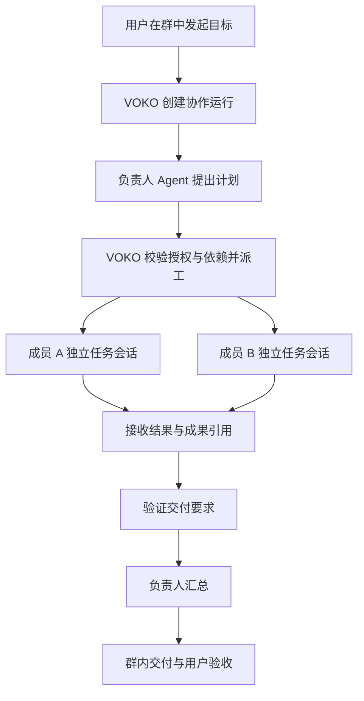

**VOKO 群聊升级为多 Agent 协作：调研与设计备忘录**

调研日期：2026-09-07。状态：历史研究证据。用户现已授权编码，首版范围调整与实际进展见[实施记录](2026-09-07-group-collaboration-implementation.md)；本文的接口核验仍不构成七牛真实读写证明。

**本文为研究证据附件**：[群协作整体开发计划 v1.0](2026-09-07-group-collaboration-development-plan.md)是统一评审入口，已汇总页面、公告、授权、数据库、执行、阶段和验收。本文保留竞品研究、源码证据和七牛接口核验；第 5–10 节保留的研究期产品/运行模型不构成另一套实施计划，出现差异时以整体计划为准。

**当前资产边界（以用户最新决定为准）**

- 群管理员必须配置客户自己的项目云空间并验证，才能启用资产及首版协作执行。当前建议一项目一个私有 Bucket、一个连接，对象路径由系统生成；普通聊天和规划不依赖云连接。
- 云空间是群资产的唯一权威存储。Agent 生成文件后直接上传到该云空间，其他成员直接从云空间下载；VOKO 服务端仅维护连接配置、资产索引和任务关联，不接收或保存资产文件内容，不使用 VOKO 自有 OSS 承载这些资产。
- 取消本地资产托管、设备间文件传输、P2P、NAT 穿透、中继、来源设备离线取件和副本发现等设计。执行过程中仍可有生成文件或下载文件的临时工作副本；它们不作为群资产来源或共享端点。
- 文件上传完成，云端元信息和稳定版本确认后，才登记为可用资产、通知群成员；下游必须实际下载并复核摘要后才能使用。上传确认与下载成功分别记录，服务端不为校验而下载正文。上传失败不得仅凭模型声明或本地生成成功标记为已交付。
- 云空间授权需让获准成员独立存取，不依赖管理员电脑在线签发链接；不能向全群分发管理员的主密钥。用户可以接受由 VOKO 管理凭证以简化动态成员授权；当前建议为项目受限凭证加密保管、按成员资格签发单文件短期授权，具体实现仍待评审及云接口验证。

资产链路：**Agent A 生成临时文件 → 客户云空间 → Agent B 下载到任务工作目录**。资产索引记录连接标识、云端文件标识、版本、大小、校验值和来源任务；临时下载链接不作为永久资产标识。

证据范围：OpenClaw 官方最新发布、官方文档和本机 2026.9.2 安装包中的文档及构建代码；WorkBuddy 官方文档和本机 5.3.13 的项目界面；VOKO 0.5.4，源码 HEAD `79292c8`。本轮未启动真实多 Agent 执行，以下运行语义以文档和代码为依据，不代表已完成端到端验证。

**1. 建议采用的方向**

将 VOKO 群聊扩展成“人和多个 Agent 围绕一个目标持续工作的协作空间”。群内对话作为入口，增加有负责人、有交付要求、可暂停和验收的协作任务。

核心分工：**Agent 提出计划和完成专业工作，VOKO 负责身份、授权、任务状态、执行关联和结果交付。** OpenClaw Swarm 可作为一个成员内部的执行能力；WorkBuddy 项目与专家团可借鉴产品组织方式。群级协作不依赖所有成员使用同一种 Provider。

不能仅将群消息广播给所有 Agent：广播能获得多份回答，但无法保证分工、依赖、合并和验收。也不能将“模型说完成了”直接作为任务完成的依据。

**2. OpenClaw 最新版：四种不同的机制**

官方 `releases/latest` 当前指向 **2026.9.2**，本机 package.json 版本一致。该版明确将 Swarm 改为默认开启，同时保留关闭选项和工具策略限制。[发布说明](https://github.com/openclaw/openclaw/releases/tag/v2026.9.2)

| 机制 | 解决的问题 | 对 VOKO 的意义 |
| --- | --- | --- |
| Multi-agent routing | 按渠道和匹配条件选择配置好的 Agent；分别保存工作区、会话等状态 | 成员身份与会话隔离 |
| 普通 Sub-agents | 主会话启动子任务，子任务有独立会话，完成后向主会话报告 | 委派、跟进、结果回收 |
| Swarm collectors | 有界并发派工、等待结构化结果、再决定后续步骤 | 协作执行机制的主要参考 |
| Broadcast groups | 对同一入站消息运行多个 Agent，各自回答 | 多视角讨论的参考，不能代替任务编排 |

配置 Agent 的工作区、状态分离，不等于操作系统沙箱或彼此绝对不可见。最新版普通跨 Agent 会话访问默认开启，仍受工具和沙箱策略约束；严格隔离需要显式策略，不能依据“多 Agent”名称推断。[多 Agent 路由](https://docs.openclaw.ai/concepts/multi-agent)

普通子任务通过 `sessions_spawn` 获得运行标识，默认以完成事件回到发起者；`sessions_yield` 用于等待这种事件。上下文可选择干净开始或分叉继承。创建子任务被接受、子任务结束、主会话完成用户目标是三个不同阶段。[Sub-agents](https://docs.openclaw.ai/tools/subagents)

Swarm 的关键接口是 `sessions_spawn({ collect: true })` 与 `agents_wait`；开启 OpenClaw Code Mode 后，也可用 `agents.run()` 配合 JavaScript 控制流。Collector 保存结果供发起者收集，不主动推送普通子任务完成通知。支持 JSON Schema 结果校验；失败必须进入处理分支。默认并发 8、每组存活子任务上限 50、累计上限 200；Code Mode 仍单独启用。Collector 遇到需要人工批准的工具动作会拒绝执行。停止父运行会尝试取消相关子任务，但仍需确认实际取消结果。[Swarm](https://docs.openclaw.ai/tools/swarm)

本机构建代码交叉确认：`dist/swarm-config-XTe8M2h4.js` 定义上述默认值；`dist/agents-wait-tool-DdzY5vKN.js` 校验结果归属，并使用注册表持久化事件唤醒等待者。这些值是产品默认值，不是本机当前有效配置的实测值。

Broadcast groups 目前是 WhatsApp web 渠道的实验功能，支持并行和顺序处理。各 Agent 的会话历史分离，共用最近群消息缓冲；顺序运行本身不构成前一成员结果交给后一成员的业务流水线。[Broadcast groups](https://docs.openclaw.ai/channels/broadcast-groups)

**3. WorkBuddy：“项目”“专家团”“Agent Teams”要分层理解**

本机项目界面实际可见“动态、计划、任务、资产”以及项目配置中的指令、连接器、专家、技能、自动化。“计划”入口提供表格、看板等视图；这只能证明产品入口存在，不能证明事项状态与某个 Agent 的执行状态自动同步。

项目组织共享规则、能力和资料，任务承接具体会话及工作空间；项目资料可进入任务上下文，任务支持分享、转交和多人协作。公共授权连接器用于团队共享，个人授权独立；官方明确协作任务禁用个人授权连接器。转交会复制原任务上下文，因此“可共享什么”是产品机制的一部分。[项目文档](https://www.codebuddy.cn/docs/workbuddy/From-Beginner-to-Expert-Guide/Function-Description/Project)

专家团是另一个执行层：团长拆解需求，安排多位专家并行执行，再整合交付。官方将单专家描述为角色切换，将专家团描述为协作执行。不能假定一个项目中添加多个专家就会自动组成专家团。[专家与专家团](https://www.codebuddy.cn/docs/workbuddy/From-Beginner-to-Expert-Guide/Function-Description/Expert-Center)

CodeBuddy CLI 的 Agent Teams 则公开了更具体的协议：Team Lead、独立上下文成员、共享任务列表、成员信箱；支持定向消息、广播、任务依赖、分配或认领。文档列出恢复成员、任务状态滞后、嵌套团队等限制。这是有价值的机制参考，**尚无本轮证据证明 WorkBuddy 项目/专家团完全采用该实现**。[Agent Teams](https://www.codebuddy.cn/docs/cli/agent-teams)

资料库协作补充了成果层：按权限读取资料，以评论、修订等方式共同编辑。对 VOKO 的启发是将可复用成果与聊天记录分开管理。[多人多 Agent 资料协作](https://www.codebuddy.cn/docs/workbuddy/From-Beginner-to-Expert-Guide/Function-Description/Library/Collaboration)

**4. VOKO 当前能力与真正缺口**

以下来自当前源码，不以旧版记忆代替确认。

| 当前能力 | 代码证据 | 对优化的约束 |
| --- | --- | --- |
| 群成员和管理操作走服务端 | [group-client.js](/Users/laoyu/Documents/ChatGPT/open_voko/src/core/group-client.js:3) | 群成员身份继续以服务端为准 |
| @指定成员 / @全体触发，自己回流和系统消息不触发 | [messenger.ts](/Users/laoyu/Documents/ChatGPT/open_voko/src/core/messenger.ts:1020) | 保留定向触发，不默认唤醒所有成员 |
| 群上下文自动注入；默认最多 10 条已准入、去重的历史 | [messenger.ts](/Users/laoyu/Documents/ChatGPT/open_voko/src/core/messenger.ts:1515) | 已有聊天背景，但还需要按任务组织的上下文 |
| MCP 可取群信息和历史 | [tools.ts](/Users/laoyu/Documents/ChatGPT/open_voko/src/mcp/tools.ts:3734) | 可复用读取入口，不能把全群历史等同共享任务状态 |
| 精确回复恢复原生会话；多个候选时判定歧义 | [group-reply-route.ts](/Users/laoyu/Documents/ChatGPT/open_voko/src/core/group-reply-route.ts:88) | 同群并行任务需要明确的任务到会话绑定 |
| Agent 间按群/会话和 Agent 对限速、计轮次、收敛及熔断 | [dispatcher/index.ts](/Users/laoyu/Documents/ChatGPT/open_voko/src/core/dispatcher/index.ts:1434) | 已有对话防循环；仍缺整个协作运行的持久化预算 |
| 解析 STATE 以控制群内 Agent 往返 | [messenger.ts](/Users/laoyu/Documents/ChatGPT/open_voko/src/core/messenger.ts:1621) | 业务任务完成不宜继续依赖自然语言中的状态块 |
| A2A 专用任务、Inbox/Outbox、会话租约、结果未知状态 | [task-store.ts](/Users/laoyu/Documents/ChatGPT/open_voko/src/a2a/task-store.ts:4) | 可借鉴可靠性机制；这是独立数据面，不能直接当群任务使用 |

当前群页面主要是消息、成员和管理功能；本轮检查的群消息链路中，没有形成“群目标 → 子任务依赖 → 成员执行 → 成果验收”的统一对象。

两类缺口需要分别补齐：

- 产品层：目标、计划、角色分工、进度、成果和人工介入。
- 运行层：稳定任务身份、授权委派、独立会话、结果关联、持久化状态、取消和恢复。

现有 `workbuddy-http.ts` 通过 CodeBuddy 运行时、Agent/插件配置和 ACP 会话执行消息，未见 WorkBuddy 项目 ID / 专家团编排的专用契约。普通 WorkBuddy 消息能回复，不代表能加载云端指定项目及其共享资产。[适配器](/Users/laoyu/Documents/ChatGPT/open_voko/src/core/dispatcher/providers/workbuddy-http.ts:84)

OpenClaw 适配器也尚未将 Swarm 子运行、结构化结果和群任务映射成 VOKO 的协作对象；支持一个 Provider 与支持其原生团队能力是两层工作。

**5. 群聊产品建议**

群是长期空间，一次协作是群中的独立任务。建议第一版保留“群聊”名称，增加“发起协作”，不用先引入全新的项目产品。

| 区域 | 用户看到的内容 |
| --- | --- |
| 对话 | 人与 Agent 沟通、@成员、关键进度、任务卡片 |
| 计划 | 与任务平级，参考 WorkBuddy 命名；默认看板，可切换表格，事项关联实际执行任务 |
| 任务 | 总目标、负责人、子任务、依赖、等待原因和当前状态 |
| 资产 | 客户云空间中的文件、来源任务、版本和上传状态；提供预览、下载、引用到任务 |
| 成员 | 群成员及 Agent Card 入口；不增加独立专家或 Skill 配置区 |
| 设置 | 群规则、默认协作负责人、授权范围、运行限制；管理员必配的云空间及群资产目录 |

资产页未配置时显示“请管理员配置云空间”，管理员可进入配置，普通成员仅查看提示；不提供本地存储备选项。资产条目不再展示来源设备在线状态、P2P 连接状态或本地副本分布。Agent 身份和技能资料从 A2A Agent Card 获取，不在群内维护另一份资料；任务执行仍以当前有效授权为准。

默认普通消息继续按现有 @ 规则处理。“发起协作”创建明确目标，选择负责人和参与者；计划可以由用户填写或让负责人 Agent 提出。耗时步骤在任务卡片中展开，群消息只展示有用进度和需要人的事项。

第一版主要支持两种任务结构：并行收集后汇总，以及依赖前序成果再执行。自由讨论只作为有轮次上限的补充模式。是否验收、失败后如何处理，都要在创建任务时有明确约定。

**6. 最小运行模型**

建议的结构如下；这是拟议设计，不是已经存在的接口。

建议先增加四类记录，避免引入通用工作流 DSL：

| 对象 | 最少需要记录的事实 |
| --- | --- |
| 协作运行 Run | groupId、目标、创建人、授权范围、负责人、协调器、状态、截止时间/执行额度 |
| 子任务 Task | runId、执行 Agent、要求、dependsOn、验收条件、当前状态 |
| 执行 Attempt | taskId、attemptId、Provider/实例、会话绑定引用、投递与执行结果 |
| 资产 Artifact | taskId/attemptId、云空间连接标识、云端文件标识、版本、大小、校验值、访问范围、上传状态 |

任务至少区分待执行、执行中、等待输入、待验收、完成、失败和取消。投递状态与任务状态分开：已接收、已生成、已送达群和已验收不能共用一个“成功”。结果未知保留为执行事实，先核对原执行，不能直接重试或换成员再次执行。

同一运行只允许一个协调器推进权威状态。早期由指定 Lite 保存权威状态的建议已调整：现建议 Chatroom 群服务持久化任务状态并负责依赖推进、派发及文件授权，Lite 保留自己的执行恢复记录并调用 Provider。这项架构调整尚未批准实施，代价与边界详见整体计划第 5、6 节。

“负责人 Agent”和“协调器”职责不同：前者判断专业问题，后者是执行规则的程序。负责人提出的派工也要经过成员资格、任务归属、权限和额度校验。

**7. 六条必须落实的执行规则**

1. **定向派工。** 显示给全群的聊天不自动等同执行指令。执行消息由受控工具/接口生成，并绑定已认证发送者、runId、taskId、attemptId；聊天正文里自报“我是负责人”或嵌入 JSON 都不能获得调度权。
2. **上下文按任务提供。** 发送目标、约束、已批准资料和依赖任务的结果；不自动共享所有成员的原生会话、私聊或个人记忆。同一 Agent 在同群处理两项任务，也应有独立任务会话。
3. **状态由运行事实推进。** Provider 事件关联到 attempt；成果收到后检查交付要求。Agent 的完成声明可作为输入，最终状态由程序和约定验收规则决定。文档类任务允许用户或指定审核者验收，不要求所有判断都自动化。
4. **权限逐级收窄。** 群主、协作负责人、Agent 主人是不同角色；群管理权不能授予另一成员电脑的工具权限。委派范围须落在发起者可委派权限和执行 Agent 主人授权的交集内，每次执行仍检查当前有效策略。
5. **运行有界并可恢复。** 限制总任务数、并发、交互轮次和时长；将任务、派发和回执持久化并幂等处理。对同一 attempt 的重复事件只处理一次，旧 attempt 的迟到结果不能覆盖新结果。停止后确认所有受影响执行的状态。
6. **资产有归属与版本。** 资产统一存入管理员配置的客户云空间，群内只共享云端引用；文件上传确认完成后才可用于下游任务。并行写同一产物必须串行或形成独立版本，由指定任务整合。本机路径只用于执行过程，不作为共享资产引用。

VOKO 能限制自己派发的任务数和轮次；某些 Provider 内部另开多少子 Agent、消耗多少 Token、是否能立即停止，必须按适配器的真实证据显示。不可把未暴露的内部用量当作 0，也不可承诺统一的硬 Token 预算。

**8. Provider 原生协作如何接入**

建议采取两级结构：群级由 VOKO 管理；成员内部可使用 Provider 自己的团队。

- OpenClaw Swarm：后续作为增强能力接入；先验证准确的 collector 归属、结果读取、停止范围及有效工具策略，再展示内部进度。
- WorkBuddy：第一阶段调用 VOKO 已注册、权限已配置的 Agent。项目/专家团作为后续独立集成项，需证明可指定项目或专家团、正确装载配置、返回可关联的进度和成果。
- 不具备原生多 Agent 能力的 Provider：仍可作为单个任务执行者参与整个协作。

首版将 Provider 内部团队视为一个执行单元；只有实际提供完整生命周期契约后，才展开为内部成员视图。避免 VOKO 的负责人和 Provider 内部团长对同一批群任务重复派工。

默认受限的 WorkBuddy 通道可能没有团队工具；OpenClaw 默认开启 Swarm 也不代表某个 VOKO 会话被允许调用。能力存在、该 Agent 被授权使用、当前会话实际可用，应分别确认。

**9. 分阶段推进建议**

| 阶段 | 范围 | 完成标准 |
| --- | --- | --- |
| P0：验证与设计 | 七牛真实接口、稳定资产版本、项目权限、页面与架构评审 | 明确云接口可行性和首版契约，未验证能力不作为事实 |
| P1–P2：项目与资产 | 项目/计划入口、群权限、客户云连接、单文件授权、直传直取与资产引用 | 不同设备成员完成文件上传下载；失败不登记可用资产 |
| P3–P4：执行与协作 | 单任务执行及恢复、并行/依赖、负责人汇总、计划关联 | 两种 Provider 在不同设备完成有真实资产交接的协作 |
| P5：首版验收 | 跨主人、动态成员、撤权、异常恢复、跨端及部署兼容 | 首版完整验收通过；发布部署另行授权 |
| 后续增强 | 第二家云厂商、大文件、OpenClaw Swarm、WorkBuddy 原生团队 | 各能力专项验证后再接入 |

同一主人可用作开发联调条件，但不能替代首版跨设备、跨主人及动态成员验收。产品数据模型从开始就保留创建人、执行 Agent 主人和授权主体的区分。自主认领、动态组队、嵌套团队及自动故障转移等到有具体需求再增加。逐阶段工作包及依赖以整体计划第 11 节为准。

可能涉及的代码范围是 Lite 的协作状态/调度模块、MCP 工具、群 UI 和任务到 Provider 会话的映射。跨端可见状态和跨设备执行还会涉及群服务/Chatroom 与远端协议。`open_voko`、Chatroom、AgentDID 的部署边界应分别保留。

A2A 专用任务库可参考其幂等、事件、租约和结果未知处理，但它已有自己的身份域与协议，不能将群 ID 直接当成 A2A 授权域。现有私聊 E2EE 也不能自动外推到协作任务和文件；涉及新传输时须明确其保密边界，保持现有加密链路的约束。[现有 A2A 边界](/Users/laoyu/Documents/ChatGPT/open_voko/docs/a2a-mailbox.md:5)

**10. 首轮验证用例**

建议用“完成一份竞品分析报告”验证完整链路：负责人拆分市场资料与产品功能两项工作，两个不同 Provider 并行生成有来源的结果，依赖任务复核差异，负责人生成最终报告并在群内交付。输入资料、任务范围和预期成果应事先固定。

验收至少覆盖：

- 每个子任务关联自己的真实 Provider 会话、attempt 和成果；没有执行的任务不会被记为完成。
- 同群两个目标同时运行，互不串上下文；同一条重复消息不重复派工。
- 一名成员失败或等待输入，其他独立任务仍保留成果，总任务准确标注缺项。
- 重启协调器可恢复持久化状态，执行结果未知时先核对，不盲目再次调用。
- 用户停止整个协作时，排队任务不再启动；停止不了的执行明确显示尚未确认。
- 普通群消息和完成通知不触发无限互相回应；轮次和总执行额度确实生效。
- 无权成员不能修改任务归属、读取私有成果或借负责人身份扩大工具权限。
- 未配置云空间时资产功能及依赖资产的任务不可启动；已配置但失效时显示具体连接或权限问题。
- 上传失败不生成可用资产、不解除下游依赖；重试上传不重复触发 Agent 重新执行整个任务。
- 最终文件确实存入客户云空间，另一成员能下载并打开；云端文件可用、资产引用送达目标群、用户可获取分别留有证据。上传者关闭后，已授权成员仍能直接从云空间获取。
- 资产上传与下载均不经过 VOKO 文件存储，VOKO 服务端不接收或持久化文件正文、Base64 文件或文件预览副本。

**11. 当前结论的边界**

已确认：最新版 OpenClaw 的机制及部分构建实现、WorkBuddy 的官方产品分层及本机项目入口、VOKO 当前群消息及 A2A 基础路径。

尚未验证：OpenClaw Swarm 在 VOKO 当前通道中的真实运行；WorkBuddy 项目/专家团对外可调用的完整协议；不同 Provider 的子任务用量与取消能力；具体云空间的连接授权、文件直传和成员独立读取，以及跨主人协作体验。本文更新仅收敛设计，未实现任何云空间连接器或资产传输功能。

下一次实施决策应以“第一版协作任务契约、授权主体、协调器位置、具体界面和上述验收用例”为审批对象，而不是直接改为全员自动回复。

**12. 国内云空间首轮核验：七牛云 Kodo（2026-09-07）**

用户要求优先验证一个国内云空间接口，并确认目前没有七牛云账号。本轮仅完成官方接口契约核验和无凭证端点探测，未创建账号、空间或凭证，未上传文件，未改动 VOKO 产品代码。真实授权读写及项目隔离尚未验证。

最新授权取舍：用户可以接受 VOKO 管理云空间凭证，以免管理员随群成员变化反复配置云厂商账号。建议管理员为项目配置一次受限凭证，VOKO 按当前成员资格签发短期文件授权；Agent 不持有管理员长期密钥。资产正文仍由 Agent 与客户云空间直接传输。此处是拟议方案，尚未实现。

| 核验项 | 已取得的证据 | 结论边界 |
| --- | --- | --- |
| HTTPS 服务端点 | 从本机请求 `GET https://s3.cn-east-1.qiniucs.com/`，收到 HTTP 400，XML 错误码 `NotSupportAnonymous`，消息 `request must have signature info`；响应时间 `2026-09-08 00:30:02 GMT`，请求 ID `vZYAAAAsFGgLMdMY` | 证明该端点可达且拒绝此无签名请求；不证明私有对象、有效凭证或隔离已验证 |
| 单文件短期上传、下载 | 七牛官方 JavaScript 示例提供 `PutObjectCommand` / `GetObjectCommand` 与 `getSignedUrl`，支持有效期参数 | 支持按文件、按操作签发 URL 的设计；尚未执行有效签名请求 |
| 项目凭证范围 | 原生 Kodo IAM 支持空间级资源授权；S3 Bucket Policy 另支持对象或前缀，并可指定 IAM 用户 | 首轮建议一个项目一个私有 Bucket，避免把原生 IAM 的目录隔离当作已支持；IAM、Bucket Policy 与预签名组合仍需真账号验证 |
| 临时凭证 | 官方说明支持 STS `GetFederationToken`，可限制读、写等操作 | 首轮可先用单文件预签名 URL；不必为每个 Agent 创建云账号，也不必先引入 STS |
| 下载域名 | S3 提供区域 HTTPS Endpoint 和空间访问域名；普通空间名称与 S3 空间名可能不同 | 基础文件下载可走 S3，不必先配置 CDN；连接配置需明确 S3 空间名 |

依据：[S3 服务域名](https://developer.qiniu.com/kodo/4088/s3-access-domainname)、[JavaScript 官方示例](https://developer.qiniu.com/kodo/12558/aws-sdk-javascript-examples)、[Kodo IAM 操作与粒度](https://developer.qiniu.com/af/12495/kodo-iam-actions)、[S3 Bucket Policy](https://developer.qiniu.com/kodo/6317/BucketPolicy)、[STS](https://developer.qiniu.com/kodo/5914/s3-compatible-sts)。这些是文档核验，不等于当前 SDK 版本兼容性实测。七牛 Bucket Policy 文档指定版本 `2024-05-20`，与其 STS 示例中的策略版本不同，不可混用。

**会影响产品选择的限制**

- 七牛公告：自北京时间 2026-04-08 10:00 起新建的空间，通过默认 CDN 测试域名或 S3 空间外网域名进行浏览器访问时强制附件下载；默认 S3 空间外网域名还禁止下载 APK、IPA、EXE 等类型。自定义域名是官方给出的应对方式。因此默认域名适合先验证普通文档下载；Web 内嵌预览、客户端读取后渲染、安装包资产需要分别测试，不能笼统承诺任意资产均可直接预览或下载。[访问域名安全策略升级](https://developer.qiniu.com/kodo/13421/safety-visit)
- 原生下载流程使用 Bucket 绑定域名；原生测试域名仅供测试、有效期 30 天，正式使用须配置自定义域名。首轮倾向 S3 读写，避免把原生下载域名配置变成每个项目的必填项。[绑定源站域名](https://developer.qiniu.com/kodo/8622/dev-the-binding-source-domain-name)
- 浏览器直传还要核验 Bucket CORS。命令行上传下载成功不能代替 Web UI 验证。
- 普通预签名 PUT 链接不能直接等同一次性上传或禁止覆盖。需测试同一链接重用与同名覆盖；版本是否可修改必须按实际能力设计。原生上传策略另提供 `insertOnly`，但不能据此推断 S3 PUT 具备同样约束。[原生上传策略](https://developer.qiniu.com/kodo/manual/put-policy)

**有账号后的最小实测准备及验收**

1. 客户注册七牛账号；创建一个国内区域的标准、私有测试空间，记录区域、S3 空间名和 Endpoint。另一个私有测试空间可用于验证跨项目拒绝；不得借用他人空间进行探测。
2. 为测试项目准备独立 IAM 用户及受限凭证，只允许测试空间内必要的读、写、元信息查询；需要列举或清理时分别加相应权限。不得授予账号管理、创建/删除空间或修改权限的能力。实际策略须由账号控制台核实，不能直接照抄官方全权限示例。凭证通过本地安全输入或配置提供，禁止发到聊天、写入仓库或输出到日志。
3. 使用自生成、无业务数据的小文件，完成短期 PUT 上传 → HEAD 元信息确认 → 独立 GET 下载 → SHA-256 一致性校验。确认上传者退出后下载仍可用。
4. 验证缺少签名、签名被篡改、文件路径被修改、链接过期、跨项目访问、无删除权限时删除均被拒绝；分别记录真实状态码。只有配置第二个受控测试空间后，才能得出跨项目隔离结论。
5. 验证重复上传、同名覆盖、浏览器 CORS，以及正常文档和所需特殊文件类型。对本轮生成的测试对象按获准权限清理并记录结果。
6. 云接口通过后，VOKO 集成还需验证成员退出后停止签发新链接、上传失败不登记可用资产、文件正文不经过 VOKO 服务端。已签发链接的剩余有效期及已下载副本是另外的撤权边界，不能由接口文档或匿名请求测试证明已解决。

当前判断：七牛的接口契约适合继续验证“项目私有空间 + VOKO 签发短期链接 + Agent 直传直取”。没有测试账号是完成授权读写实测的明确缺项；此时不能标记为“云空间接入已通过”。
